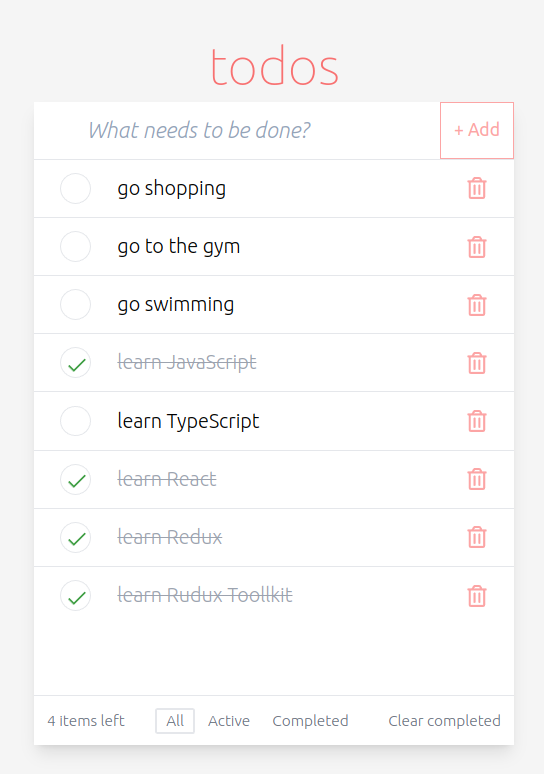

# [Todos App](https://todos-app-o96h.vercel.app/)
### Completed test task for Mindbox company 

### Link to the test task - [description](https://docs.google.com/document/d/1jq5yCrQJRHaRG4TabGhDITDMteYuLWG_LjlR9HmB5ac/edit)


## Stack:
- React
- TypeScript
- Redux Toolkit
- TailwindCSS
- ESLint
- Prettier
- Husky


## App Preview:



---

## Setup

```bash
git clone git@github.com:MikRyam/todosApp.git

npm install
# or
yarn install
```

## Getting Started

```bash
npm run start
# or
yarn start
```

## Other available Scripts

```bash
# run ESLint
yarn lint

# run Prettier
yarn format

# run tests
yarn test
```

## Bundle application

```bash
# run build
yarn build
```
